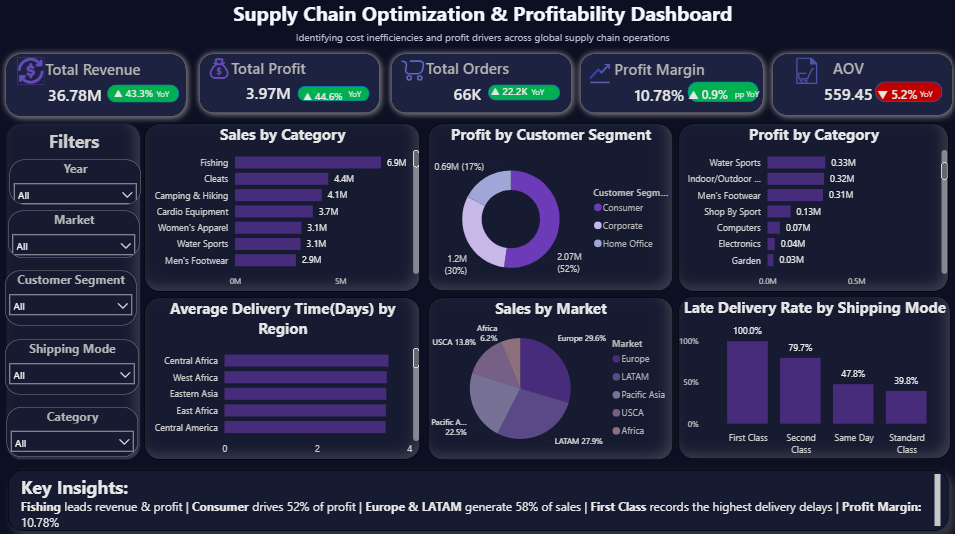

# Supply Chain Optimization & Profitability Analysis

## Executive Summary

### Business Problem

The organization lacked a centralized analytical solution to evaluate supply chain performance across sales, profitability, customer segments, markets, and shipping operations. Without clear visibility into operational metrics, identifying profitable categories, inefficient shipping methods, and opportunities for cost optimization was challenging.

### Solution

Developed an end-to-end Supply Chain Analytics solution using Python, SQL, and Power BI. The project involved cleaning and transforming raw supply chain data, performing exploratory data analysis, creating business-focused metrics, conducting SQL-based analysis, and developing an interactive dashboard to monitor performance and generate actionable insights.

### Business Impact

The analysis provided visibility into key business drivers:

- Analyzed 66K+ orders generating 36.78M in revenue.
- Identified profitability drivers contributing to 3.97M total profit.
- Evaluated product categories, customer segments, markets, and shipping operations.
- Highlighted opportunities to improve delivery efficiency and increase profit margins.
- Enabled data-driven decision-making through an interactive Power BI dashboard.

### Next Steps

Future improvements include:

- Developing predictive models for demand forecasting.
- Building customer lifetime value analysis.
- Implementing inventory optimization models.
- Creating automated reporting pipelines for real-time monitoring.

---

# Business Problem

Supply chain organizations generate large volumes of operational and sales data, but raw data alone does not provide actionable business insights.

The company required a Business Intelligence solution to answer key questions:

- Which product categories generate the highest revenue and profit?
- Which customer segments contribute the most profitability?
- Which markets drive business growth?
- Are shipping operations efficient?
- Where are delivery delays affecting customer experience?
- How can profitability be improved through operational optimization?

This project addresses these challenges by transforming raw supply chain data into meaningful insights through analytics and visualization.

---

# Project Objectives

- Analyze overall sales and profitability performance.
- Identify revenue and profit-driving categories.
- Evaluate customer segment contribution.
- Compare performance across global markets.
- Measure shipping efficiency and delivery performance.
- Calculate important business KPIs.
- Build an interactive Power BI dashboard for executive reporting.
- Provide actionable recommendations for improving profitability.

---

# Project Workflow
Raw Supply Chain Dataset
|
▼
Data Understanding & Initial Exploration
|
▼
Data Cleaning Using Python
|
▼
Exploratory Data Analysis (EDA)
|
▼
Feature Engineering & KPI Creation
|
▼
SQL Business Analysis
|
▼
Power BI Data Modeling & Dashboard Development
|
▼
Business Insights & Recommendations

---

# Methodology

## 1. Data Collection & Initial Review

- Imported raw supply chain dataset.
- Reviewed dataset structure, data types, and business variables.
- Identified important dimensions and measures required for analysis.

## 2. Data Cleaning (Python)

Python was used to prepare the dataset for analysis.

Cleaning activities included:

- Removed duplicate records.
- Handled missing values.
- Standardized categorical variables.
- Converted date columns into appropriate formats.
- Validated numerical fields.
- Corrected inconsistent values.
- Prepared clean data for analysis and visualization.

Tools used:

- Python
- Pandas
- NumPy

## 3. Exploratory Data Analysis (EDA)

EDA was performed to identify business trends, relationships, and operational patterns.

Analysis included:

- Revenue distribution analysis.
- Profit distribution analysis.
- Product category performance.
- Customer segment analysis.
- Regional market analysis.
- Shipping mode performance.
- Delivery delay analysis.
- Revenue versus profit relationship analysis.

Visualization tools:

- Matplotlib
- Seaborn

## 4. Feature Engineering

Additional business metrics were created to improve analytical depth:

- Profit Margin
- Average Order Value (AOV)
- Late Delivery Rate
- Category Revenue Contribution
- Category Profit Contribution
- Market Sales Contribution
- Customer Segment Profit Contribution
- Average Delivery Time
- Year-over-Year (YoY) KPI Comparison

## 5. SQL Business Analysis

SQL was used to perform business analysis and answer key operational questions.

SQL concepts applied:

- SELECT Statements
- Aggregate Functions
- GROUP BY
- ORDER BY
- CASE Statements
- INNER JOIN
- LEFT JOIN
- Subqueries
- Common Table Expressions (CTEs)
- Window Functions
- Ranking Functions

## 6. Power BI Dashboard Development

An interactive dashboard was developed to provide business stakeholders with a clear overview of supply chain performance.

Dashboard features:

- KPI Cards
- Interactive Filters
- Dynamic Slicers
- Sales Performance Analysis
- Profitability Analysis
- Category Performance
- Customer Segment Analysis
- Market Analysis
- Shipping Performance
- Business Insights Panel

---

# Skills Demonstrated

## Python

- Data Cleaning
- Data Transformation
- Exploratory Data Analysis
- Feature Engineering
- Business Metric Creation

## SQL

- Business Querying
- Data Aggregation
- Joins
- CTEs
- Window Functions
- Ranking Analysis

## Power BI

- Data Modeling
- DAX Measures
- KPI Development
- Dashboard Design
- Interactive Reporting
- Business Storytelling

## Business Analytics

- Supply Chain Analysis
- Profitability Analysis
- Performance Monitoring
- Insight Generation
- Decision Support

---

# Results

## Key Performance Indicators

| Metric | Value |
|---|---:|
| Total Revenue | 36.78M |
| Total Profit | 3.97M |
| Total Orders | 66K |
| Profit Margin | 10.78% |
| Average Order Value | 559.45 |

---

# Results & Business Insights

### Product Performance

Fishing was the highest-performing category, generating approximately 6.9M revenue and 0.76M profit, making it the strongest profitability driver.

### Customer Segment Analysis

Consumer customers contributed approximately 52% of total profit, making them the most valuable customer segment.

### Market Analysis

Europe contributed 29.6% of total sales, while LATAM contributed 27.9%, together representing nearly 58% of overall revenue.

### Shipping Performance

First Class shipping showed the highest late delivery rate, indicating potential operational inefficiencies affecting customer satisfaction.

### Profitability Analysis

Although the business generated 36.78M in revenue, the overall profit margin of 10.78% highlights opportunities for cost optimization and operational improvements.

---

# Business Recommendations

## Improve Performance of High-Profit Categories

Focus investment on categories such as Fishing by:

- Maintaining sufficient inventory levels.
- Promoting related products.
- Optimizing pricing strategies.

This can increase revenue while protecting profitability.

## Improve First Class Shipping Efficiency

Since First Class shipping recorded higher delivery delays:

- Evaluate carrier performance.
- Analyze delayed regions.
- Improve transportation planning.

Reducing delays can enhance customer satisfaction and operational efficiency.

## Expand High-Performing Markets

Europe and LATAM generated the majority of sales.

Recommended actions:

- Increase targeted marketing campaigns.
- Expand product availability.
- Apply successful strategies to similar markets.

## Increase Overall Profit Margin

To improve profitability:

- Analyze high-cost operations.
- Review low-margin products.
- Optimize shipping and operational expenses.

---

# Dashboard Preview

# Author

**Sandleen Sethi** 
| Data Analyst
